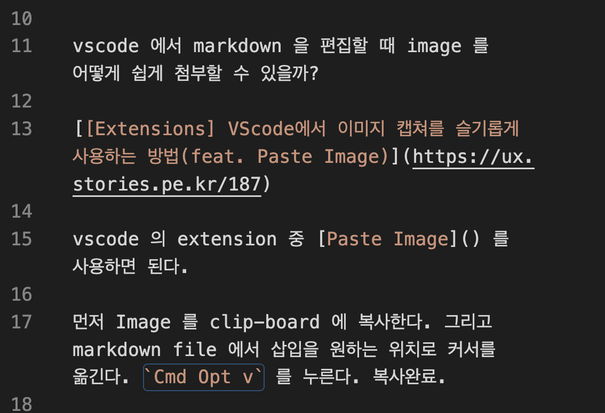
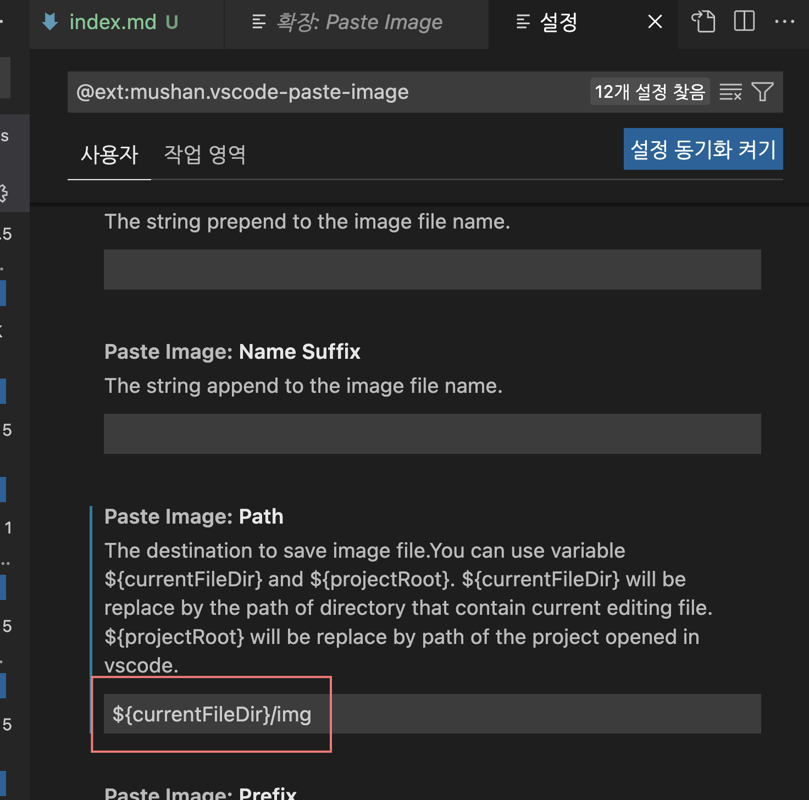
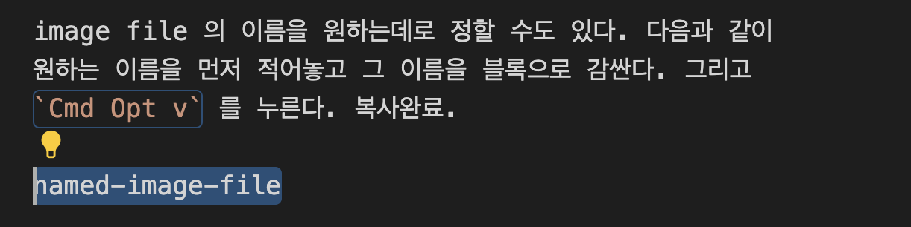

vscode 에서 markdown 을 편집할 때 image 를 어떻게 쉽게 첨부할 수 있을까?

[[Extensions] VScode에서 이미지 캡쳐를 슬기롭게 사용하는 방법(feat. Paste Image)](https://ux.stories.pe.kr/187)

vscode 의 extension 중 [Paste Image](https://marketplace.visualstudio.com/items?itemName=mushan.vscode-paste-image&ssr=false#review-details) 를 사용하면 된다.

먼저 Image 를 clip-board 에 복사한다. 그리고 markdown file 에서 삽입을 원하는 위치로 커서를 옮긴다. `Cmd Opt v` 를 누른다. 복사완료.

image 는 `img/2022-08-27-08-22-49.png` 에 저장되었다. image file path 는 [Paste Image](https://marketplace.visualstudio.com/items?itemName=mushan.vscode-paste-image&ssr=false#review-details) 의 환경설정에서 수정할 수 있다.

image file 의 이름을 원하는데로 정할 수도 있다. 다음과 같이 원하는 이름을 먼저 적어놓고 그 이름을 블록으로 감싼다. 그리고 `Cmd Opt v` 를 누른다. 복사완료.

