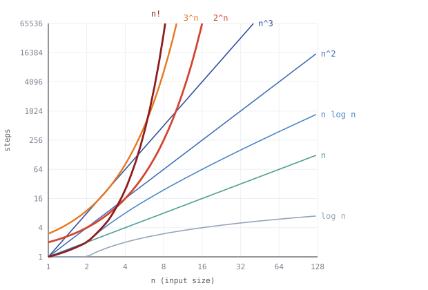

# NP 는 어려운 문제가 아닙니다

## 다들 틀리게 말합니다

"그거 NP 라서 안 돼." 이 말은 보통 아래 셋 중 하나로 쓰입니다.

| 흔히 하는 말 | 사실 |
|---|---|
| "NP 니까 빨리 못 풀지" | NP 의 N 은 "못 한다"는 뜻이 아닙니다 |
| "NP-hard 는 NP-complete 보다 좀 약한 거지" | 거꾸로입니다. NP-hard 쪽이 훨씬 넓습니다 |
| "NP-complete 면 못 푸는 거잖아" | 매일 풉니다. 운 나쁠 때만 오래 걸립니다 |

이 이름들은 1971년에 Cook 과 Levin 이 각자, 1972년에 Karp 가 이어받아 만들었습니다.
목적은 하나였습니다 — **문제가 얼마나 어려운지 재고 분류하는 것.**

정렬 문제는 complexity class 로 분류하지 않습니다. 이미 명확하게 `O(n log n)` 의
해결책이 있으니까요. complexity class 는 **아무도 좋은 알고리즘을 못 찾은 문제**를
다루려고 만든 자입니다.

## 1. 빠르다는 게 뭔가

**P** 는 다항시간에 풀 수 있는 문제입니다.



가로세로 모두 로그 눈금이라 **다항식은 전부 직선**이고, **붉은 쪽만 휘어
오릅니다.** `n³` 은 한동안 `2ⁿ` 위에 있는데도 n 이 10 쯤 되면 추월당합니다.
지수가 아무리 커도 직선은 직선이라서요. 이 벽 하나가 기준입니다.

그리고 앞으로 나올 이름 중 셋(**P · NP · NP-complete**)은 답이 "예"나 "아니오"로
나오는 문제에만 붙습니다. "이 수가 소수인가?", "미로에 출구까지 가는 길이 있나?",
"지하철로 K 분 안에 갈 수 있나?" 가 P 이고, "가장 싼 길을 내놔라"처럼 답이 경로인
문제에는 안 붙습니다.

그런데 **다항시간에 풀린다고 다 P 는 아닙니다.** 정렬 문제가 그렇습니다. 답이
"예/아니오"가 아니기 때문에 P 라고 할 수 없습니다.

## 2. 완전탐색밖에 안 떠오르는 문제들

영수증이 한 뭉치 있습니다.

```
  영수증 n 장 중에서 몇 장을 골라, 합계를 정확히 X 원으로 맞출 수 있나?
```

방법이 떠오르시나요. 저는 **전부 해보는 것** 말고는 안 떠오릅니다. 영수증마다 넣거나
빼거나 둘 중 하나니 경우의 수가 2ⁿ 입니다.

실제로 재봤습니다. 절대 만들 수 없는 금액을 목표로 줘서 끝까지 다 뒤지게
했습니다. 아래 수치는 돌려서 나온 값입니다.

```
    n   완전탐색(초) 앞 줄의 몇 배
   16          0.008            -
   18          0.031         3.9배        n 이 2 늘 때마다 네 배
   20          0.128         4.1배
   22          0.486         3.8배
   24          1.995         4.1배
   26          8.064         4.0배
```

두 장 늘 때마다 걸리는 시간이 네 배가 됩니다. 같은 컴퓨터라면 40장에 37시간,
50장에 4년입니다 — 이 둘은 재본 게 아니라 26장에서 늘린 값입니다.
**영수증 50장. 많은 양이 아닙니다. 그런데 4년입니다.**

이런 문제가 한둘이 아닙니다. 도시를 전부 한 번씩 도는 가장 싼 경로, 겹치지 않는
시험 시간표, 가방에 물건 채우기.

그런데 **"느리다"는 이것들의 공통점이 아닙니다.** 아직 이름을 안 붙이는 이유가
그겁니다. 진짜 공통점은 **푸는 쪽이 아니라 채점하는 쪽**에 있습니다.

## 3. 그런데 채점은 빠릅니다

제가 4년을 헤매는 동안 누가 와서 답을 내밉니다. "3번, 7번, 12번 영수증이요."
확인하는 데 얼마나 걸릴까요. **세 장을 더해보면 끝입니다.**

```
  푸는 시계       고르는 방법을 전부 해본다     2ⁿ 번
  채점하는 시계   가져온 답을 더해본다           n 번
```

푸는 건 막막한데 **채점은 전부 빠릅니다.** 이런 문제를 모아 **NP** 라고 부릅니다.

클레이 수학연구소가 이 문제를 소개하는 첫 문장이 정확히 이 얘기입니다.

> If it is easy to check that a solution to a problem is correct, is it also
> easy to solve the problem? This is the essence of the P vs NP question.

옮기면: 어떤 문제의 답이 맞는지 확인하기가 쉽다면, 그 문제를 푸는 것도 쉬운가?
이것이 P vs NP 질문의 핵심이다.

클레이 수학연구소 [P vs NP 페이지](https://www.claymath.org/millennium/p-vs-np/) 첫 문단에서 그대로 옮겼습니다.

N 은 non-polynomial 의 N 이 아니라 **nondeterministic**, 비결정적이라는 뜻입니다.
누군가 운 좋게 답을 찍어 왔다 치고 나는 채점만 한다 — 그 그림에서 나온 이름입니다.

그래서 **P 는 통째로 NP 안에 들어갑니다.** 직접 풀 수 있으면 채점도 되니까요. 남이
가져온 답을 무시하고 내가 다시 풀어본 다음 맞춰보면 그만입니다. 1절의 소수 판별도
미로도 전부 NP 입니다.

```
  P ⊆ NP        ⊆ 는 "안에 들어간다"
```

기호가 `⊆` 인 게 중요합니다. **P 가 NP 보다 진짜로 좁은지는 아무도 모릅니다.** 그걸
묻는 게 P vs NP 이고, 1971년 이후로 아직 안 풀렸습니다. 클레이 수학연구소의
밀레니엄 문제 일곱 개 중 하나이고, 공식 페이지를 열어보니 상금이 문제당 100만
달러입니다.

## 4. 문제를 바꿔 푼다 — reduction

**문제 A 를 문제 B 로 바꿔서 푸는 것**을 reduction 이라고 합니다. 단, 바꾸는
작업은 빨라야 합니다.

예를 들어 이런 문제가 있습니다.

```
  팀 나누기 — 숫자들을 합이 똑같은 두 묶음으로 나눌 수 있나?
     예)  8, 2, 5, 5   →   {8, 2} 와 {5, 5}. 둘 다 10. 예.
```

2절의 영수증 문제는 "몇 장을 골라 합을 목표 금액으로 맞출 수 있나?" 였습니다.
**이걸 팀 나누기 문제로 바꿔 쓸 수 있습니다.** 숫자 두 개만 끼워 넣으면 되고,
그러면 팀 나누기 기계가 영수증 문제를 대신 풀어줍니다.

```
  영수증   8  3  5  2,  목표 10        전부 더하면 18

  ① 양쪽이 각각 19 가 되게 하자       19 = 18 + 1

  ② 9 와 11 을 끼워 넣는다            9 = 19 - 10,   11 = 19 - 8

        8  3  5  2  9  11             전부 38, 반이 19

        {8, 2, 9} = 19      {3, 5, 11} = 19        나뉜다

        9 가 있는 쪽에서 9 를 빼면 {8, 2}
        8 + 2 = 10 — 영수증 문제의 답
```

**"반으로 나뉘나?" 를 풀었더니 "10 을 만들 수 있나?" 가 풀렸습니다.** 이게
reduction 입니다.

### 받아준 쪽이 더 어렵다

```
  팀 나누기 기계가 하나 있으면
      팀 나누기를 푼다       원래 하는 일
      영수증 문제도 푼다     숫자 두 개 끼워 넣고 넘기면 되니까

  A 를 B 로 바꿔 풀 수 있다   →   B 는 A 보다 쉬울 수 없다

       A = 영수증 문제,   B = 팀 나누기
```

팀 나누기 기계는 두 문제를 다 떠맡았습니다. 그러니 더 어려울 수도, 똑같을 수도
있지만 **더 쉽지는 않습니다.**

## 5. 네 이름을 한 그림에

```
  NP-hard       NP 에 있는 문제 전부가 이리로 reduction 됩니다
  NP-complete   NP-hard 인데, 자기도 NP 안에 들어 있는 것
```

NP-complete 은 NP 와 NP-hard 가 **겹치는 칸**입니다. 두 이름의 차이는 이게
전부입니다. 그리고 NP-hard 라고 해서 NP 안에 있어야 할 이유는 없습니다.

```
                          +------ NP-hard --------------------------------+
  +----- NP --------------+-------------------+                           |
  |                       |                   |                           |
  | +- P ---------------+ | NP-complete       |  Halting problem          |
  | | Is N prime?       | |                   |  Find cheapest route      |
  | | Maze has a path?  | | SAT               |  ^ both outside NP        |
  | | Reach B in K min? | | Subset Sum        |                           |
  | +-------------------+ | Partition         |                           |
  |                       |                   |                           |
  | Factor < K, not 1?    |                   |                           |
  | Two graphs same?      |                   |                           |
  |                       |                   |                           |
  +-----------------------+-------------------+                           |
                          +-----------------------------------------------+
```

P 칸은 전부 "예/아니오" 꼴로 고쳐 적은 것입니다. `Subset Sum` 이 영수증 문제,
`Partition` 이 팀 나누기입니다.

NP 칸 아래 둘은 소인수분해와 그래프 동형입니다. **NP 안에 있는 건 확실한데**
— 답을 주면 나눠보거나 짝지어보면 되니까요 — **어느 칸인지는 수십 년째 아무도
모릅니다.** 그래서 어느 쪽 상자에도 안 넣고 띄워 뒀습니다.

**Halting problem** 은 "이 프로그램이 언젠가 멈출까, 영원히 돌까?"를 묻습니다.
어려운 정도가 아니라 **아예 불가능합니다.** 1936년 Turing 이 증명했습니다. NP 안의
문제는 느려도 언젠가는 답이 나오는데 이건 그렇지 않으니 NP 에 못 들어갑니다.
그런데도 NP-hard 입니다. **NP-hard 는 NP-complete 의 약한 버전이 아니라 훨씬 넓은
이름입니다.**

## 6. 내 문제의 complexity class 정하는 법

```
  ① 어느 부류인지 보고, 판정판으로 고쳐 쓴다

       판정   "되나?"              그대로
       탐색   "하나 내놔"       →  "있나?"
       최적화 "제일 좋은 거"    →  "K 이하로 되나?"

  ② 채점기를 짤 수 있나        →  NP 안에 있다
  ③ 푸는 방법을 짤 수 있나     →  P 안에 있다
  ④ 알려진 NP-hard 문제를
     내 문제로 reduction 하나  →  NP-hard

  ⑤ ② 와 ④ 가 둘 다            →  NP-complete

  ⑥ 원래 문제로 돌아온다
       판정판이 NP-complete 였다  →  원래 탐색판·최적화판은 NP-hard
```

②③④ 는 전부 **뭔가를 만들어야** 증명됩니다. 채점기, 알고리즘, reduction.
**③도 ④도 안 되면 "아직 모른다"입니다.** 못 찾은 건 증거가 못 됩니다 — 소인수분해와
그래프 동형이 수십 년째 거기 있습니다.

### 외판원으로 한 바퀴

```
  원래 문제    "가장 싼 경로를 내놔라"            최적화
  ① 고쳐 쓰면  "비용 K 이하로 도는 길이 있나?"    판정
```

고쳐 쓴 쪽에 ②~⑤ 를 돌리면 **NP-complete** 가 나옵니다. 경로를 받아 거리를 더해
K 와 비교하면 되니 채점이 빠르고(②), 이미 NP-complete 로 알려진 "모든 점을 한 번씩
도는 길이 있나?" 를 이 문제로 reduction 할 수 있습니다(④).

이제 원래 문제로 돌아옵니다. **"가장 싼 경로"를 찾아주는 기계가 있다면, 찾아서 K 와
비교하는 것만으로 판정판도 풀립니다.** 판정판이 NP-complete 이니 원래 문제는 적어도
그만큼 어렵습니다. 그래서 **NP-hard** 입니다. NP-complete 는 못 됩니다 — 답이
경로라 NP 에 들어갈 자격이 없으니까요.

**일반적으로 "이거 NP-hard 예요"라고 말하게 되는 문제는 이 최적화판입니다.**

### 최초의 NP-complete 문제는 누가 증명했나

④ 에는 이미 알려진 문제가 필요한데 맨 처음엔 그게 없습니다. **사다리의 첫 칸은
reduction 으로 만들 수 없습니다.**

1971년 Cook 이, 1973년 Levin 이 각자 그 일을 해냈습니다. **SAT** 이 NP-complete
임을 **정의에서 직접** 증명한 겁니다. SAT 은 `(A 또는 B) 그리고 (A 아니다)` 같은
식을 주고 전체를 참으로 만드는 조합이 있는지 묻습니다(A=거짓, B=참).

**첫 번째 NP-complete 문제 하나로 충분했습니다.** 그다음부터는 SAT 에서 reduction
해 나가기만 하면 됐고, 1972년 Karp 가 21개, 1979년 Garey & Johnson 의 부록에
320개가 그렇게 쌓였습니다.

### 실무에서는 ④를 거의 안 합니다

내 문제가 **이미 증명이 끝난 문제와 같은 꼴**인 경우가 훨씬 많기 때문입니다.
그럴 땐 reduction 을 새로 짤 것 없이 남의 결론을 그대로 가져다 쓰면 됩니다.

```
  내 문제                 같은 꼴인 알려진 문제

  배달 순서 짜기       =  외판원         →  외판원이 NP-hard 니 이것도 NP-hard
  시험 시간표          =  그래프 색칠
  작업 배분            =  팀 나누기
  패키지 버전 맞추기   =  SAT
```

**"어, 이거 외판원인데?" 하고 알아보는 게 실제로 쓰는 기술입니다.**

## 7. 누가 만들었나

| 누가 | 언제 | 무엇을 했나 |
|---|---|---|
| Hartmanis · Stearns | 1965 | **분야 자체를 만들었습니다.** "computational complexity" 라는 이름, 자원 한도로 문제를 묶는다는 발상(complexity class), 시간 계층 정리 |
| Cobham · Edmonds | 1965 | **P 를 정의했습니다.** 각자 독립으로 "다항시간 = 실용적으로 풀린다"를 제안. 그래서 Cobham–Edmonds 명제라고 부릅니다 |
| Cook · Levin | 1971 | **NP-completeness 를 만들었습니다.** 각자 독립으로. SAT 이 첫 번째 NP-complete |
| Karp | 1972 | **쓸모를 증명했습니다.** 21개 고전 문제가 전부 NP-complete 임을 보여서, 이론이 아니라 도구가 됐습니다 |
| Garey & Johnson | 1979 | **정리했습니다.** 이론서 + 320개 목록. 실무자가 찾아 쓸 수 있게 만들었습니다 |

```
  1965  Hartmanis · Stearns  "문제를 자원 한도로 묶자"          ← 틀
  1965  Cobham · Edmonds     "다항시간이 그 경계다"             ← P
  1971  Cook · Levin         "채점이 빠른 묶음도 있다"          ← NP, NP-complete
  1972  Karp                 "그게 현실 문제 21개에 다 걸린다"  ← 확산
  1979  Garey & Johnson      "320개를 찾아 쓰게 정리했다"       ← 사전
```

뒤의 둘은 발명이 아니라 **적용과 정리**를 했습니다. Karp 와 Garey & Johnson 이
유명한 이유도 거기 있습니다 — 책상 위 개념을 일하는 사람이 쓸 수 있게 만들었습니다.

## 8. 시간 말고 다른 기준들

빅오는 복잡도 이론보다 70년 앞섭니다. 수학자 Paul Bachmann 이 1894년에 만들고
Landau 가 1909년에 확장했으며, 전산학에 들여온 건 Knuth 입니다.

complexity class 도 하나가 아닙니다. **무엇을 자원으로 보느냐**에 따라 기준이
갈리고, P 와 NP 는 그중 "시간" 하나입니다.

```
  시간      P, NP, EXP    몇 단계 만에 끝나나
  공간      L, PSPACE     메모리를 얼마나 쓰나
  무작위    BPP, RP       동전을 던져도 되면
  양자      BQP           양자 컴퓨터라면
  병렬      NC            여러 대를 동시에 쓰면
```

이 글이 시간만 다룬 건 그게 실무에서 제일 자주 걸리기 때문입니다.

## 확실하지 않은 것

- `P ≠ NP` 는 아직 아무도 증명하지 못했습니다. 겹침 그림은 `P ≠ NP` 를 가정하고
  그렸습니다.
- Cook 1971 의 다섯 개는 원문 전사본에서, Garey & Johnson 부록의 320개는 원본을
  열어 범주별로 직접 세었습니다. Levin 1973의 6개는 영역본, Karp 1972 의 21개는 2차 자료입니다.
- 클레이 페이지가 확인해 주는 것은 "Cook 과 Levin 이 1971년에 각자 P vs NP 를
  정식화했다"까지입니다. Levin 1973 은 논문 발표 연도입니다.
- 측정치는 파이썬 완전탐색 기준이라 언어와 컴퓨터가 바뀌면 절대 시간은 달라집니다.
  두 장 늘 때마다 네 배라는 것만 가져가면 됩니다. 40장과 50장은 잰 게 아니라
  26장(8.064초)에서 2ⁿ 으로 늘린 값입니다.

## 출처

이 글에 나온 숫자는 전부 여기서 직접 세었습니다.

**이름을 만든 사람들**

- **Hartmanis · Stearns 1965** · Juris Hartmanis, Richard E. Stearns,
  *On the Computational Complexity of Algorithms*, Transactions of the AMS 117.
  분야와 이름을 만든 논문. 여기서 나온 시간 계층 정리가 "어떤 칸은 진짜로 벌어져
  있다"를 증명합니다. 1993년 튜링상.
- **Cobham 1965** · Alan Cobham, *The Intrinsic Computational Difficulty of
  Functions*. P 를 처음 거론한 논문으로 꼽힙니다.
- **Edmonds 1965** · Jack Edmonds, *Paths, Trees, and Flowers*, Canadian
  Journal of Mathematics 17. 같은 해에 따로. 둘을 묶어 Cobham–Edmonds 명제라
  부릅니다.

**NP 와 NP-complete**

- **Cook 1971** · Stephen A. Cook, *The Complexity of Theorem-Proving
  Procedures*, STOC 1971. 사다리의 첫 칸. 어려워 보이는 문제 5개를 나란히
  적어뒀는데, 그중 소수 판별은 2002년에 P 로 내려갔고 그래프 동형은 아직
  모릅니다. — [전사본](http://4mhz.de/cook.html)
- **Levin 1973** · Leonid A. Levin, *Universal Sequential Search Problems*, Problems of
  Information Transmission 9(3), 265–266. Cook 과 독립으로. "있나 없나"가 아니라
  "찾아라" 형태의 문제 6개. — [영역본](https://www.karlin.mff.cuni.cz/~krajicek/levin.pdf)
- **Karp 1972** · Richard M. Karp, *Reducibility Among Combinatorial Problems*,
  Complexity of Computer Computations, Plenum Press, 85–103. 사다리가 놓이자마자
  한 논문에서 21개. — [논문 페이지](https://doi.org/10.1007/978-1-4684-2001-2_9)
- **Garey & Johnson 1979** · Michael R. Garey, David S. Johnson, *Computers and
  Intractability: A Guide to the Theory of NP-Completeness*, W. H. Freeman.
  NP-완전성만 다룬 첫 책. 부록에 320개가 실려 있고, 이름 뒤 `(*)` 는 NP 소속이
  밝혀지지 않았다는 — 즉 NP-complete 가 아니라 NP-hard 라는 — 표시입니다.

**본문에 나온 나머지**

- **Turing 1936** · Alan M. Turing, *On Computable Numbers, with an Application
  to the Entscheidungsproblem*, Proc. London Mathematical Society. Halting
  problem 이 풀 수 없는 문제라는 증명.
- **AKS 2002** · Manindra Agrawal, Neeraj Kayal, Nitin Saxena, *PRIMES is in P*,
  2002년 8월 6일. 소수 판별이 P 로 내려간 날. 2006년 괴델상·풀커슨상.
- **빅오 표기** · Paul Bachmann 이 1894년에 도입하고 Edmund Landau 가 1909년에
  확장했습니다. Bachmann–Landau 표기라고도 합니다.
- **클레이 수학연구소** ·
  [P vs NP](https://www.claymath.org/millennium/p-vs-np/) ·
  [밀레니엄 문제](https://www.claymath.org/millennium-problems/).
  본문의 영어 인용과 상금 액수를 여기서 확인했습니다.

## 더 볼 것

- MIT — [6.046 P, NP, NP-completeness, Reductions](https://www.youtube.com/watch?v=eHZifpgyH_4) ·
  [6.006 Computational Complexity](https://ocw.mit.edu/courses/6-006-introduction-to-algorithms-fall-2011/resources/lecture-23-computational-complexity/)
